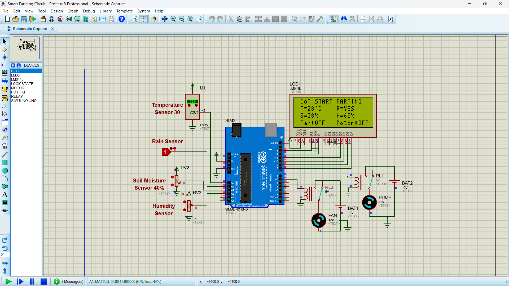

# 🌱 IoT Smart Farming System

<p align="center">
  
</p>

<p align="center">
  
</p>

<p align="center">


</p>

---

## 🌱 Project Overview

This project is a **smart farming system simulated in Proteus using Arduino Uno**.

The system monitors important environmental conditions such as **temperature, rainfall, soil moisture, and humidity**. Based on the sensor readings, the Arduino automatically controls a **fan and water pump**.

The main idea is simple: instead of manually checking the conditions and operating equipment, the system continuously monitors the environment and makes basic decisions automatically.

---

## ⚙️ How It Works

The Arduino continuously reads four inputs:

| Parameter        | Input | Purpose                |
| ---------------- | ----- | ---------------------- |
| 🌡️ Temperature  | A0    | Monitors temperature   |
| 🌧️ Rain         | A1    | Detects rainfall       |
| 🌱 Soil Moisture | A2    | Monitors soil moisture |
| 💧 Humidity      | A3    | Monitors air humidity  |

The readings are displayed on a **20×4 LCD**.

Example:

```text
IoT SMART FARMING
T=28'C     R=YES
S=40%      H=65%
Fan:OFF    Motor:OFF
```

---

## 🤖 Automatic Control

The system has two main outputs.

### 🌬️ Fan Control

The fan is activated when:

```text
Temperature > 30°C
```

Otherwise:

```text
Fan = OFF
```

### 💧 Water Pump Control

The water pump is activated when:

```text
Soil Moisture < 40%
AND
Rain = NO
```

Otherwise:

```text
Pump = OFF
```

This prevents the pump from running when the soil is dry but rain is already detected.

---

## 🔄 Control Logic

```text
             ┌─────────────────────┐
             │     SENSOR INPUTS   │
             └──────────┬──────────┘
                        │
        ┌───────────────┼────────────────┐
        ↓               ↓                ↓
   Temperature        Rain          Soil Moisture
        │               │                │
        └───────────────┼────────────────┘
                        ↓
                ┌───────────────┐
                │    ARDUINO    │
                │      UNO      │
                └───────┬───────┘
                        │
             ┌──────────┴──────────┐
             ↓                     ↓
        Temperature >30°C    Soil <40% + No Rain
             │                     │
             ↓                     ↓
          FAN ON                PUMP ON
```

---

## 🖥️ Simulation

The entire system is simulated in **Proteus 8 Professional**.

<p align="center">
  
</p>

### 🎬 Simulation Animation

<p align="center">
  
</p>

> Replace `simulation.gif` with your actual Proteus screen-recording GIF when you upload it.

---

## 🔌 Main Components

* Arduino Uno
* LM35 Temperature Sensor
* Rain Sensor
* Soil Moisture Sensor
* Humidity Sensor
* 20×4 LCD
* Relay Modules
* DC Fan
* Water Pump
* 12V Battery Supply
* Proteus 8 Professional

---

## 💻 Arduino Code

The Arduino program continuously reads the sensors, converts the readings into usable values, displays them on the LCD, and controls the fan and pump according to the programmed conditions.

```cpp
#include <LiquidCrystal.h>

LiquidCrystal lcd(13, 12, 11, 10, 9, 8);

const int Fan_Pin = 6;
const int Pump_Pin = 7;

void setup()
{
  lcd.begin(20, 4);

  lcd.setCursor(0, 0);
  lcd.print(" IoT SMART FARMING    ");

  pinMode(Fan_Pin, OUTPUT);
  pinMode(Pump_Pin, OUTPUT);
  pinMode(A1, INPUT);
}

void loop()
{
  int S1 = analogRead(A0);

  float mV = (S1 / 1023.0) * 5000;
  int Temp = mV / 10;

  lcd.setCursor(0, 1);
  lcd.print(" T=");
  lcd.print(Temp);
  lcd.print("'C  ");

  int R = digitalRead(A1);

  if (R == 0)
  {
    lcd.setCursor(10, 1);
    lcd.print(" R=NO ");
  }

  if (R == 1)
  {
    lcd.setCursor(10, 1);
    lcd.print(" R=YES ");
  }

  int S3 = analogRead(A2);
  int SM = S3 / 10;

  lcd.setCursor(0, 2);
  lcd.print(" S=");
  lcd.print(SM);
  lcd.print("%  ");

  int S4 = analogRead(A3);
  int H = S4 / 10;

  lcd.setCursor(10, 2);
  lcd.print(" H=");
  lcd.print(H);
  lcd.print("%  ");

  if (Temp > 30)
  {
    digitalWrite(Fan_Pin, HIGH);

    lcd.setCursor(0, 3);
    lcd.print(" Fan:ON  ");
  }
  else
  {
    digitalWrite(Fan_Pin, LOW);

    lcd.setCursor(0, 3);
    lcd.print(" Fan:OFF ");
  }

  if (SM < 40 && R == 0)
  {
    digitalWrite(Pump_Pin, HIGH);

    lcd.setCursor(10, 3);
    lcd.print(" Motor:ON  ");
  }
  else
  {
    digitalWrite(Pump_Pin, LOW);

    lcd.setCursor(10, 3);
    lcd.print(" Motor:OFF  ");
  }
}
```

---

## 📊 Sensor & Control Conditions

| Condition                     | Action      |
| ----------------------------- | ----------- |
| Temperature > 30°C            | 🌬️ Fan ON  |
| Temperature ≤ 30°C            | 🌬️ Fan OFF |
| Soil Moisture < 40% + No Rain | 💧 Pump ON  |
| Soil Moisture ≥ 40%           | 💧 Pump OFF |
| Rain Detected                 | 💧 Pump OFF |

---

## 🧠 What I Learned

This project helped me understand how different sensors can be combined with a microcontroller to create an automatic control system.

I practiced:

* Arduino analog and digital input handling
* Sensor interfacing
* LCD interfacing
* Conditional control logic
* Relay-based actuator control
* Automatic irrigation logic
* Environmental monitoring
* Proteus circuit simulation

---

## 🚀 Possible Improvements

The current simulation can be extended into a more complete smart agriculture system by adding:

* 📡 ESP32/ESP8266 connectivity
* 📱 Mobile monitoring
* ☁️ Cloud data logging
* 📈 Sensor data graphs
* 🌐 Web dashboard
* 🔔 SMS or notification alerts
* ⚡ Solar-powered operation
* 🤖 More advanced automatic irrigation control

---

## 📁 Repository Contents

```text
IoT-Smart-Farming/
│
├── circuit-1.4.png
├── simulation.gif
├── Code.ino
└── README.md
```

---

## 🎯 Project Goal

The goal of this project was to explore how **sensors, Arduino, and automatic control systems** can be combined to solve a practical agricultural problem.

It is a small simulation, but it demonstrates the basic idea behind larger agricultural automation systems where environmental data can be used to make decisions automatically.

---

## 👨‍💻 Author

**Adhan Lenin**

B.Tech Mechatronics Engineering Student

**Interests:**
Robotics • Embedded Systems • CAD • Automation • Computer Vision • Mechatronics

---

<p align="center">

### 🌱 Build → Simulate → Learn → Improve

</p>
